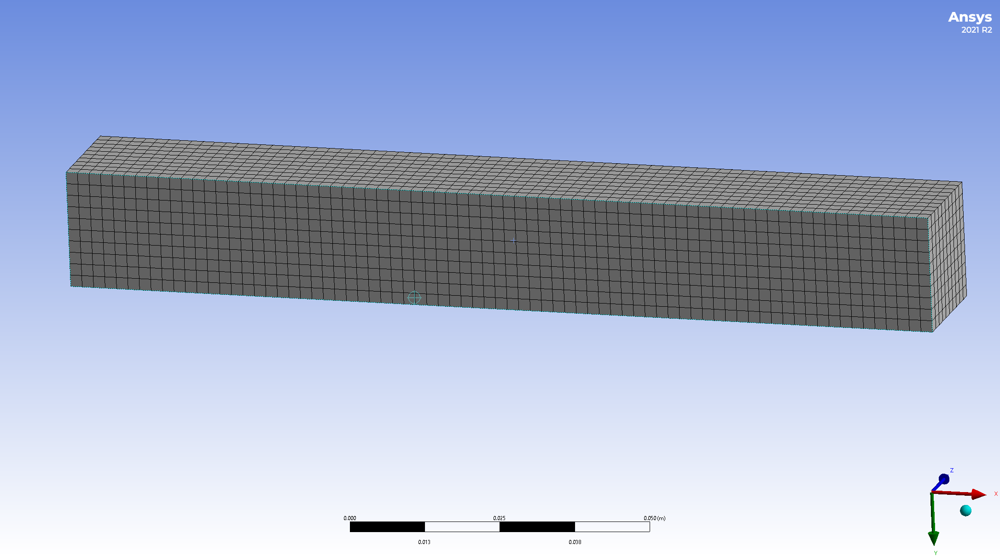

# Lineární algebra I

Lineární algebra se zabývá vícerozměrnými veličinami (vektory) a vztahy mezi
nimi. 

## Motivace

Jednou ze základních úloh v praxi je posoudit reakci objektu na působení vnějších sil. Například změna tvaru při namáhání. Pro popis úloh tohoto typu zpravidla dělíme těleso na malé elementy a popisujeme, co se s těmito elementy děje: o kolik se posunou, jestli a jak změní svůj tvar nebo objem a podobně. 

  

Pro modelování deformace potřebujeme mít možnost jednoznačně identifikovat dílčí elementy a být schopni popsat změnu jejich tvaru a polohy při deformaci. K tomu je možno použít souřadnice. V prostoru jsou souřadnice tvořeny trojicemi, v rovině dvojicemi čísel. Takové objekty patří v matematice mezi vektory.

## Vektory

Základním objektem v lineární algebře je vektor. Nejčastěji vyjadřujeme vektory jako uspořádané $n$-tice nebo orientované úsečky. 

### Příklady vektorů

* Dvourozměrné a trojrozměrné vektory se používají k práci s fyzikálními
  veličinami, u kterých si všímáme směru. 
  Příklady zahrnují následující.
  * Rychlost pohybu. 
      * Orientovaná úsečka, jejíž orientace udává směr pohybu a délka udává okamžitou rychlost.
      * Uspořádaná dvojice nebo trojice, kde jednotlivé komponenty udávají rychlost ve směru příslušných os.
  * Polohový vektor bodu v prostoru spojuje počátek s uvažovaným bodem. Opět můžeme modelovat jako orientovanou úsečku z počátku do příslušného bodu, nebo dvojici či trojici hodnot udávající souřadnice bodu. Pro pohybující se bod je tento vektor funkcí času.
  * Posunutí, tj. změna polohy v prostoru Tento vektor spojuje počáteční a koncovou pozici
    posunutého bodu.
  * Síla a moment síly.
  * Spád skalární veličiny. Tento vektor dává do pohybu transportní děje, jako transport tepla, transport vody materiálem, transport iontů nebo molekul při impregnaci apod. Směr ukazuje, kterým směrem klesá veličina nejrychleji a velikost udává, jaká tato rychlost je. 
* Vícerozměrné vektory se používají u jakékoliv sady dat, kterou uspořádáme do
  sloupce nebo řádku. Poté má smysl pracovat s vektory libovolné dimenze.
  Příklady zahrnují následující.
  * Na konstrukci je zvoleno $N$ bodů. Sledujeme změnu polohy těchto
    bodů. Pokud se body mohou pohybovat s jedním stupněm volnosti,
    dostáváme $N$-rozměrný vektor. Obecněji, pokud není pohyb omezen,
    musíme sledovat polohu ve všech třech nezávislých směrech a
    pracujeme s vektorem dimenze $3N$.
  * Podobně jako předchozí příklad, ale můžeme pracovat s bodovými silami
    působícími na konstrukci.
  * Na objektu je zvoleno $N$ bodů a sledujeme teplotu v těchto bodech.   

### Operace s vektory

**Násobení vektoru s číslem** je definováno jako součin daného čísla a jednotlivých komponent  vektoru, resp. jako vektor mířící *stejným směrem* jehož délka je odpovídajícím násobkem délky původního vektoru. (V případě záporného čísla násobíme absolutní hodnotou a otáčíme směr).

* Pro $\vec u = \begin{pmatrix} 3\cr 1\end{pmatrix}$ platí $3\vec u = \begin{pmatrix} 9\cr 3\end{pmatrix}$.
* Grafické násobení: 

**Sčítání vektorů** je definováno po složkách pro uspořádané $n$-tice a jako celkové posunutí složené ze dvou dílčích posunutí pro orientované vektory. Variantou grafického sčítání vektorů je doplnění na rovnoběžník, viz obrázky.

1. **Algebraický součet.** Pro $\vec u = \begin{pmatrix} 3\cr 1\end{pmatrix}$ a $\vec v = \begin{pmatrix} 2\cr 5\end{pmatrix}$ platí $\vec u +\vec v = \begin{pmatrix} 5\cr 6\end{pmatrix}$.
1. **Grafický součet.** Buď umístíme jeden vektor do koncového bodu druhého vektoru, nebo doplníme na rovnoběžník. 
 

## Matice

### Motivace - matice tuhosti a poddajnosti, zatížení nosníku

Na praktické ukázce deformace nosníku si ukážeme zavedení čtyřrozměrných vektorů, matice a součinu matice s vektorem.

Sledujeme nosník ve vybraných čtyřech uzlových bodech. V těchto bodech je nosník
zatížen silami $f_1$, ..., $f_4$ a vlivem těchto sil je deformován nosník o
$u_1$, ..., $u_4$. Síly působí svisle, výchylky bodů jsou ve svislém směru.

Předpokládejme, že stejně jako na pružině je deformace úměrná síle. Předpokládejme, že deformace od různých sil se sčítají. Poté máme následující vztahy. 

$$ 
\begin{aligned}
u_1 = k_{11}f_1 + k_{12} f_2 + k_{13}f_3 + k_{14}f_4\cr
u_2 = k_{21}f_1 + k_{22} f_2 + k_{23}f_3 + k_{24}f_4\cr
u_3 = k_{31}f_1 + k_{32} f_2 + k_{33}f_3 + k_{34}f_4\cr
u_4 = k_{41}f_1 + k_{42} f_2 + k_{43}f_3 + k_{44}f_4\cr
\end{aligned}
$$ (1)

Toto jsou celkem čtyři vztahy obsahující jako data čtyři veličiny. V reálu jsou sledovaných bodů tisíce místo čtyř a proto se jedná o nepraktický zápis pro práci (tisíce rovnic a tisíce neznámých).

#### Řádkový a sloupcový index

Soustavu {eq}`1` je možné zapsat kratším způsobem ve tvaru 

$$
u_i= k_{i1}f_1 + k_{i2} f_2 + k_{i3}f_3 + k_{i4}f_4
$$

pro $i\in\{1,2,3,4\}$ nebo dokonce 

$$
u_i= \sum_{j=1}^4 k_{ij}f_j.
$$

Poslední výraz bývá obvyklejší zapsat pomocí Einsteinovy notace, kdy se vynechává znaménko pro sumu a přes opakovaný index se sčítá. Tedy soustava se zjednoduší na $$u_i=k_{ij}f_j.$$

Tento zápis je již krátký i pro tisíce rovnic, ale jedná se vlastně jenom o jiný zápis obrovské soustavy rovnic. V následujících odstavcích si ukážeme jiný přístup.

#### Vektorový a maticový zápis

Jinou variantou je použití sloupcových vektorů, kde soustavu {eq}`1` přepíšeme do tvaru

$$
\begin{pmatrix}u_1\cr u_2\cr u_3\cr u_4\end{pmatrix}=
\begin{pmatrix}k_{11}\cr k_{21}\cr k_{31}\cr k_{41}\end{pmatrix} f_1 +
\begin{pmatrix}k_{12}\cr k_{22}\cr k_{32}\cr k_{42}\end{pmatrix} f_2 +
\begin{pmatrix}k_{13}\cr k_{23}\cr k_{33}\cr k_{43}\end{pmatrix} f_3 +
\begin{pmatrix}k_{14}\cr k_{24}\cr k_{34}\cr k_{44}\end{pmatrix} f_4.
$$ (2)

Tento tvar představuje jedinou rovnici mezi čtyřrozměrnými vektory. Naznačená operace se provádí po složkách. Jedná se o operaci kombinující součin čísel s vektory a sčítání vektorů. Tato operace se nazývá *lineární kombinace vektorů*.

Aby síly byly také ve formě vektoru, zapisujeme rovnici zpravidla ve tvaru 

$$
\begin{pmatrix}u_1\cr u_2\cr u_3\cr u_4
\end{pmatrix}=
\begin{pmatrix}
k_{11} & k_{12} & k_{13}& k_{14} \cr
k_{21} & k_{22} & k_{23}& k_{24} \cr
k_{31} & k_{32} & k_{33}& k_{34} \cr
k_{41} & k_{42} & k_{43}& k_{44} \cr
\end{pmatrix} 
\begin{pmatrix}f_1\cr f_2\cr f_3\cr f_4
\end{pmatrix},
$$ (3)

přičemž obdélníkové schema vyplněné hodnotami se nazývá matice. Tímto je zaveden nový objekt (*matice*) a nová operace (*součin matice a vektoru*). 

Po přeznačení 

$$
U = \begin{pmatrix}u_1\cr u_2\cr u_3\cr u_4
\end{pmatrix}, \quad K=
\begin{pmatrix}
k_{11} & k_{12} & k_{13}& k_{14} \cr
k_{21} & k_{22} & k_{23}& k_{24} \cr
k_{31} & k_{32} & k_{33}& k_{34} \cr
k_{41} & k_{42} & k_{43}& k_{44} \cr
\end{pmatrix} , \quad F = 
\begin{pmatrix}f_1\cr f_2\cr f_3\cr f_4
\end{pmatrix}
$$

dostáváme 

$$
U = K F,
$$

kde $U$ je vektor deformací, $F$ je vektor působících sil a $K$ je *matice poddajnosti*. Toto je již relativně jednoduchý vztah. Reprezentuje totiž jednu rovnici, která vyjadřuje, že jedna veličina je součinem dvou jiných veličin. V určitém smyslu je stejně jako u pružiny deformace úměrná působící síle, ovšem deformace a síla jsou vyjádřeny vektorem a konstanta úměrnosti maticí.

Podobně je možné postupovat i naopak a vyjádřit síly pomocí deformací vztahem $$F=CU,$$ kde $C$ je *matice tuhosti*.

Operace {eq}`3` mezi maticí a vektorem definovaná vztahem {eq}`2` se nazývá maticový součin. Později si ukážeme, jak tuto definici rozšířit na dvě matice.

## Definice maticového součinu

Součin matice a vektoru definujeme jako lineární kombinaci sloupců matice, při které jsou koeficienty komponenty vektoru. 

Pro trojrozměrný vektor $\vec v =\begin{pmatrix}v_1\cr v_2\cr v_3\end{pmatrix}$ a čtvercovou matici 

$$A = 
\begin{pmatrix}
a_{11} &a_{12}& a_{13}\cr
a_{21} &a_{22}& a_{23}\cr
a_{31} &a_{32}& a_{33}
\end{pmatrix}
$$ 

dostáváme 

$$  
A\vec v = 
\begin{pmatrix} a_{11} \cr a_{21} \cr a_{31}  \end{pmatrix} v_1 +
\begin{pmatrix} a_{12} \cr a_{22} \cr a_{32}  \end{pmatrix} v_2 +
\begin{pmatrix} a_{13} \cr a_{23} \cr a_{33}  \end{pmatrix} v_3.
$$

## Využití maticového součinu: zobrazení vektorů

V praxi používáme matice ve zobrazeních, kde je obrazem vektoru opět vektor. Maticové zobrazení má jistá specifika. 

* Obrazem nulového vektoru je vždy nulový vektor. 
* Obrazem násobku vektoru je násobek obrazu vektoru. 
* Obrazy rovnoběžných vektorů jsou rovnoběžné.
* Obraz vektoru nemusí být rovnoběžný se vzorem.

První tři vlastnosti platí i pro násobení vektoru skalárním číslem. V tomto případě však automaticky vychází vzor a obraz rovnoběžný. Díky použití matice namísto skalární hodnoty jsme schopni modelovat i situace, kdy vzor a obraz nemusí mít stejný směr. 

## Využití maticového součinu: konstituční zákony

Konstituční zákony jsou zákony, které udávají, jak materiál reaguje na vnější podnět. 

* Při nerovnoměrném rozložení teploty v tělese se teplota vyrovnává vedením tepla. Intenzita děje souvisí se spádem teploty. 
* Při nerovnoměrném vlhkosti nebo koncentrace nějaké látky v tělese se nerovnovážná situace vyrovnává difuzí. Difuzní tok souvisí se spádem koncentrace. 

V izotropních materiálech má podnět stejný směr jako odezva a souvislost mezi nimi může být zprostředkována násobením skalární hodnotou. V anizotropních materiálech je však situace jiná. Materiálové vlastnosti závisí na směru. Například v některém směru materiál vede teplo lépe, než ve směru jiném. Proto se tok tepla vždy stáčí do tohoto preferovaného směru a nemusí mít stejný směr jako spád teploty. Vztah mezi podnětem a odezvou je možné vyjádřit pomocí maticového násobení. 

**Příklad.** <a href="../notebooks/konstitucni_zakony.html">Ilustrační zápisník</a> ukazuje výpočet toku tepla ve dřevě a v hliníku. Vektor definující pokles teploty je stále stejně dlouhý a tři scénáře se liší směrem. U hliníku je tok vždy stejně velký a vždy míří stejným směrem, jako je pokles teploty. U dřeva tomu tak není. 

## Využití maticového součinu: geometrické transformace

Matice jako zobrazení vektoru na vektor  

* <a href="../notebooks/matice_geometricka_zobrazeni.html">Ilustrační zápisník</a>
* Sloupce matice popisující zobrazení jsou obrazy jednotkových vektorů ve směru os.
* Jednotková matice (sestavená z jednotkových vektorů ve směru os, tj. s jedničkami v hlavní diagonále a nulami jinak) odpovídá identickému zobrazení, každý vektor se zobrazí sám na sebe. 

$$
I = \begin{pmatrix} 1&0&0\cr0&1&0\cr 0&0&1
\end{pmatrix}
$$
* Matice rotace o úhel $\theta$ proti směru hodinových ručiček má tvar 

$$
\begin{pmatrix}
\cos\theta&-\sin\theta\cr
\sin\theta&\cos\theta
\end{pmatrix}.
$$

* Součet a rozdíl matic je definován po složkách. Součin matic je definován jako složené zobrazení (viz též níže).

## Homogenní souřadnice, posunutí a projekce

### Homogenní souřadnice. 

* Vzniknou doplněním jedničky jako další souřadnice. Pracuje se s nimi
  jako s vektory v dimenzi o jedničku větším. Například bod $[1,2]$ má
  v homogenních souřčadnicích tvar $(1,2,1)$
* Před převodem z homogenních souřadnic do kartézských je nutné
  zajistit na poslední pozici jedničku a poté převést na bod v
  kartézských souřadnicích. Například $(6,90,3)$ jsou homogenní
  souřadnice bodu $[2,30]$.

### Posunutí pomocí maticového součinu. 

V homogenních souřadnicích neplatí podmínka, že nula se zobrazuje na
nulu. Je možné takto realizovat například posunutí.

### Perspektiva pomocí maticového součinu

V homogenních souřadnicích neplatí podmínka, že se rovnoběžky
zobrazují na rovnoběžky. Tím je možné maticový součin použít pro
obrázky s perspektivou.

## Maticový součin dvou matic

* Maticový součin dvou matic je definován pomocí násobení matice a vektoru.
  Součin $C=AB$ je matice, která má ve sloupcích obrazy sloupců matice $B$ při
  zobrazení popsaném maticí $A$. 
* Součin $C=AB$ je možno chápat jako složené zobrazení, kdy nejprve použijme zobrazení $B$ a potom zobrazení $A$.
* Maticový součin obecně není komutativní. Obecně neplatí $AB=BA.$ 
* Maticový součin je asociativní. Platí $A(BC)=(AB)C$.
* Neutrálním prvkem je jednotková matice $I$.

## Markovovy řetězce

Matice je možné použít k modelování vývoje systémů. Z pravděpodobností
s jakou se systém nachází v jednotlivých stavech sestavíme vektor a
matici použijeme k modelování toho, jak systém přechází z jednoho
stavu do druhého.

<a href="../notebooks/matice_markov_chain.html">Ilustrativní zápisník</a>, sukcese lesa.
