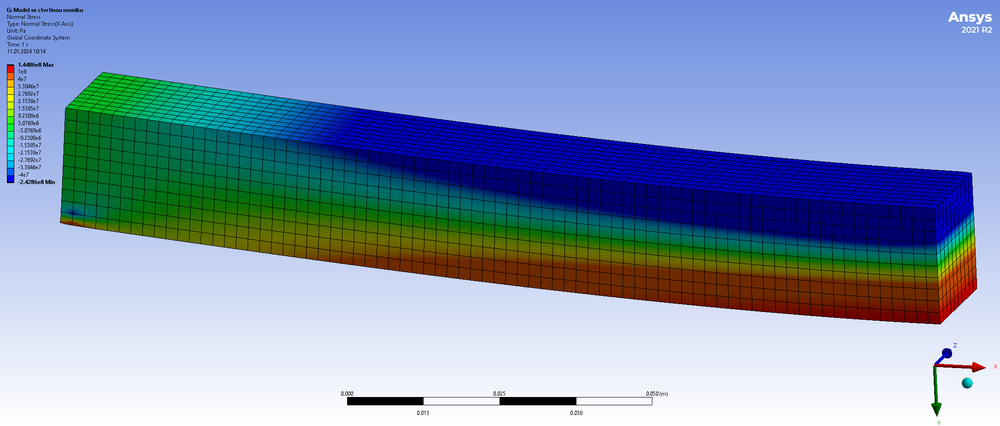

# Lineární algebra I

Lineární algebra se zabývá vícerozměrnými veličinami (vektory) a vztahy mezi
nimi. 

* Dvourozměrné a trojrozměrné vektory se používají k práci s fyzikálními
  veličinami, u kterých si všímáme směru. 
  Příklady zahrnují následující.
  * Rychlost pohybu.
  * Polohový vektor v prostoru (spojuje počátek s uvažovaným bodem)
  * Posunutí (změna polohy v prostoru, vektor spojuje počáteční a koncovou pozici
    posunutého bodu)
  * Síla a moment síly
* Vícerozměrné vektory se používají u jakékoliv sady dat, kterou uspořádáme do
  sloupce nebo řádku. Poté má smysl pracovat s vektory libovolné dimenze.
  Příklady zahrnují následující.
  * Na konstrukci je zvoleno $N$ bodů. Sledujeme změnu polohy těchto
    bodů. Pokud se body mohou pohybovat s jedním stupněm volnosti, dostáváme
    $N$-rozměrný vektor. Obecněji můžeme pracova s vektorem dimenze $3N$. 
  * Podobně jako předchozí příklad, ale můžeme pracovat s bodovými silami
    působícími na konstrukci.
  * Na objektu je zvoleno $N$ bodů a sledujeme teplotu v těchto bodech.   
## Matice tuhosti a poddajnosti, zatížení nosníku

Na praktické ukázce deformace nosníku si ukážeme zavedení čtyřrozměrných vektorů, matice a součinu matice s vektorem.

Sledujeme nosník ve vybraných čtyřech uzlových bodech. V těchto bodech je nosník
zatížen silami $f_1$, ..., $f_4$ a vlivem těchto sil je deformován nosník o
$u_1$, ..., $u_4$. Síly působí svisle, výchylky bodů jsou ve svislém směru.

Předpokládejme, že stejně jako na pružině je deformace úměrná síle. Předpokládejme, že deformace od různých sil se sčítají. Poté máme následující vztahy. 

$$ 
\begin{aligned}
u_1 = k_{11}f_1 + k_{12} f_2 + k_{13}f_3 + k_{14}f_4\cr
u_2 = k_{21}f_1 + k_{22} f_2 + k_{23}f_3 + k_{24}f_4\cr
u_3 = k_{31}f_1 + k_{32} f_2 + k_{33}f_3 + k_{34}f_4\cr
u_4 = k_{41}f_1 + k_{42} f_2 + k_{43}f_3 + k_{44}f_4\cr
\end{aligned}
$$ (1)

Toto jsou celkem čtyři vztahy obsahující jako data čtyři veličiny. V reálu jsou sledovaných bodů tisíce místo čtyř a proto se jedná o nepraktický zápis pro práci (tisíce rovnic a tisíce neznámých).

### Řádkový a sloupcový index

Soustavu {eq}`1` je možné zapsat kratším způsobem ve tvaru 

$$
u_i= k_{i1}f_1 + k_{i2} f_2 + k_{i3}f_3 + k_{i4}f_4
$$

pro $i\in\{1,2,3,4\}$ nebo dokonce 

$$
u_i= \sum_{j=1}^4 k_{ij}f_j.
$$

Poslední výraz bývá obvyklejší zapsat pomocí Einsteinovy notace, kdy se vynechává znaménko pro sumu a přes opakovaný index se sčítá. Tedy soustava se zjednoduší na $$u_i=k_{ij}f_j.$$

Tento zápis je již krátký i pro tisíce rovnic, ale jedná se vlastně jenom o jiný zápis obrovské soustavy rovnic. V následujících odstavcích si ukážeme jiný přístup.

### Vektorový a maticový zápis

Jinou variantou je použití sloupcových vektorů, kde soustavu {eq}`1` přepíšeme do tvaru

$$
\begin{pmatrix}u_1\cr u_2\cr u_3\cr u_4\end{pmatrix}=
\begin{pmatrix}k_{11}\cr k_{21}\cr k_{31}\cr k_{41}\end{pmatrix} f_1 +
\begin{pmatrix}k_{12}\cr k_{22}\cr k_{32}\cr k_{42}\end{pmatrix} f_2 +
\begin{pmatrix}k_{13}\cr k_{23}\cr k_{33}\cr k_{43}\end{pmatrix} f_3 +
\begin{pmatrix}k_{14}\cr k_{24}\cr k_{34}\cr k_{44}\end{pmatrix} f_4.
$$ (2)

Tento tvar představuje jedinou rovnici mezi čtyřrozměrnými vektory. Naznačená operace se provádí po složkách. Aby síly byly také ve formě vektoru, zapisujeme rovnici zpravidla ve tvaru 

$$
\begin{pmatrix}u_1\cr u_2\cr u_3\cr u_4
\end{pmatrix}=
\begin{pmatrix}
k_{11} & k_{12} & k_{13}& k_{14} \cr
k_{21} & k_{22} & k_{23}& k_{24} \cr
k_{31} & k_{32} & k_{33}& k_{34} \cr
k_{41} & k_{42} & k_{43}& k_{44} \cr
\end{pmatrix} 
\begin{pmatrix}f_1\cr f_2\cr f_3\cr f_4
\end{pmatrix},
$$ (3)

přičemž obdélníkové schema vyplněné hodnotami se nazývá matice.

Po přeznačení 

$$
U = \begin{pmatrix}u_1\cr u_2\cr u_3\cr u_4
\end{pmatrix}, \quad K=
\begin{pmatrix}
k_{11} & k_{12} & k_{13}& k_{14} \cr
k_{21} & k_{22} & k_{23}& k_{24} \cr
k_{31} & k_{32} & k_{33}& k_{34} \cr
k_{41} & k_{42} & k_{43}& k_{44} \cr
\end{pmatrix} , \quad F = 
\begin{pmatrix}f_1\cr f_2\cr f_3\cr f_4
\end{pmatrix}
$$

dostáváme 

$$
U = K F,
$$

kde $U$ je vektor deformací, $F$ je vektor působících sil a $K$ je matice poddajnosti. Toto je již relativně jednoduchý vztah. Reprezentuje totiž jednu rovnici, která vyjadřuje, že jedna veličina je součinem dvou jiných veličin. V určitém smyslu je stejně jako u pružiny deformace úměrná působící síle, ovšem deformace a síla jsou vyjádřeny vektorem a konstanta úměrnosti maticí.

Podobně je možné postupovat i naopak a vyjádřit síly pomocí deformací vztahem $$F=CU,$$ kde $C$ je matice tuhosti.

Operace {eq}`3` mezi maticí a vektorem definovaná vztahem {eq}`2` se nazývá maticový součin. Později si ukážeme, jak tuto definici rozšířit na dvě matice.

## Geometrické transformace

* Ukázka, jak se modeluje deformace nosníku. 
  Těleso se dělí na malé elementy. 

  
    

  Pro modelování deformace potřebujeme mít možnost jednoznačně identifikovat dílčí elementy a být schopni popsat změnu jejich tvaru a polohy při deformaci. K tomu je možno použít souřadnice a maticový počet.
* Kartézská soustava souřadnic
  * Jsou zvoleny počátek a navzájem kolmé osy (v rovině dvě, v prostoru tři). 
  * Bod ztotožníme s uspořádanou dvojicí nebo trojicí čísel udávajících vzdálenost od počátku měřenou ve směru jednotlivých os.  
* Geometrická interpretace vektoru
  * Vektor je veličina daná směrem a velikostí, například síla, rychlost, moment síly, posunutí bodu, difuzní tok, tok tepla. 
  * Znázorňujeme jej orientovanou úsečkou, jejíž směr odpovídá směru vektoru a délka souvisí s velikostí vektor. 
  * Pro početní operace používáme souřadnice vektoru. Jedná se o souřadnice koncového bodu, pokud počáteční bod přesuneme do počátku. Také se jedná o souřadnice koncového bodu v soustavě, která má nulový bod posunutý do počátečního bodu vektoru.
* Matice jako zobrazení vektoru na vektor  
  * <a href="../notebooks/matice_geometricka_zobrazeni.html">Ilustrační zápisník</a>
  * Sloupce matice popisující zobrazení jsou obrazy vektorů ve směru os.
  * Jednotková matice (sestavená z jednotkových vektorů ve směru os, tj. s jedničkami v hlavní diagonále a nulami jinak) odpovídá identickému zobrazení, každý vektor se zobrazí sám na sebe. 
  
  $$
  I = \begin{pmatrix} 1&0&0\cr0&1&0\cr 0&0&1
  \end{pmatrix}
  $$
  * Matice rotace o úhel $\theta$ proti směru hodinových ručiček má tvar 

  $$
  \begin{pmatrix}
  \cos\theta&-\sin\theta\cr
  \sin\theta&\cos\theta
  \end{pmatrix}.
  $$

* Součet a rozdíl matic je definován po složkách.

## Homogenní souřadnice, posunutí a projekce

* Homogenní souřadnice. Vzniknou doplněním jedničky jako další souřadnice. Pracuje se s nimi jako s vektory v dimenzi o jedničku větším. Před převodem z homogenních souřadnic je nutné zajistit na poslední pozici jedničku a poté převést na body.
* Posunutí pomocí maticového součinu. V homogenních souřadnicích neplatí podmínka, že nula se zobrazuje na nulu. Je možné takto realizovat například posunutí.
* Perspektiva pomocí maticového součinu. V homogenních souřadnicích neplatí podmínka, že se rovnoběžky zobrazují na rovnoběžky. Tím je možné maticový součin použít pro obrázky s perspektivou.

## Maticový součin dvou matic

* Složené zobrazení. Součin $C=AB$ je matice, která má ve sloupcích obrazy sloupců matice $B$ při zobrazení popsaném maticí $A$. Jedná se o matici složeného zobrazení, kdy nejprve použijme zobrazení $B$ a potom zobrazení $A$.
* Maticový součin obecně není komutativní. Obecně neplatí $AB=BA.$ 
* Maticový součin je asociativní. Platí $A(BC)=(AB)C$.
* Neutrálním prvkem je jednotková matice $I$.

## Markovovy řetězce

Matice je možné použít k modelování vývoje systémů. Z pravděpodobností
s jakou se systém nachází v jednotlivých stavech sestavíme vektor a
matici použijeme k modelování toho, jak systém přechází z jednoho
stavu do druhého.

<a href="../notebooks/matice_markov_chain.html">Ilustrativní zápisník</a>, sukcese lesa.
