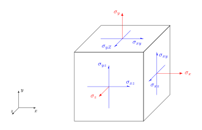

# Teorie elasticity

## Tenzor napětí

$$
\sigma = \begin{pmatrix}
\sigma_x & \sigma_{xy} & \sigma_{xz}\cr
\sigma_{xy} & \sigma_y & \sigma_{yz}\cr
\sigma_{xz} & \sigma_{xy} & \sigma_{z}
\end{pmatrix}
$$

Bilineární forma, umožňuje výpočet síly na libovolně orientované ploše

## Linearizace vektoru posunutí, tenzor deformace

* linearizace, [nelineární transfromace a její linearizace](https://gist.github.com/robert-marik/dd01d023c30454183196d9c7b967aa00)
* separace rotační, posuvné a deformační složky 
* tenzor deformace

## Hookův zákon pro izotropní, anizotropní a ortotropní materiál
## Transformace tenzoru napětí a deformace
