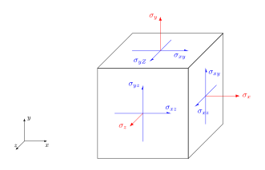
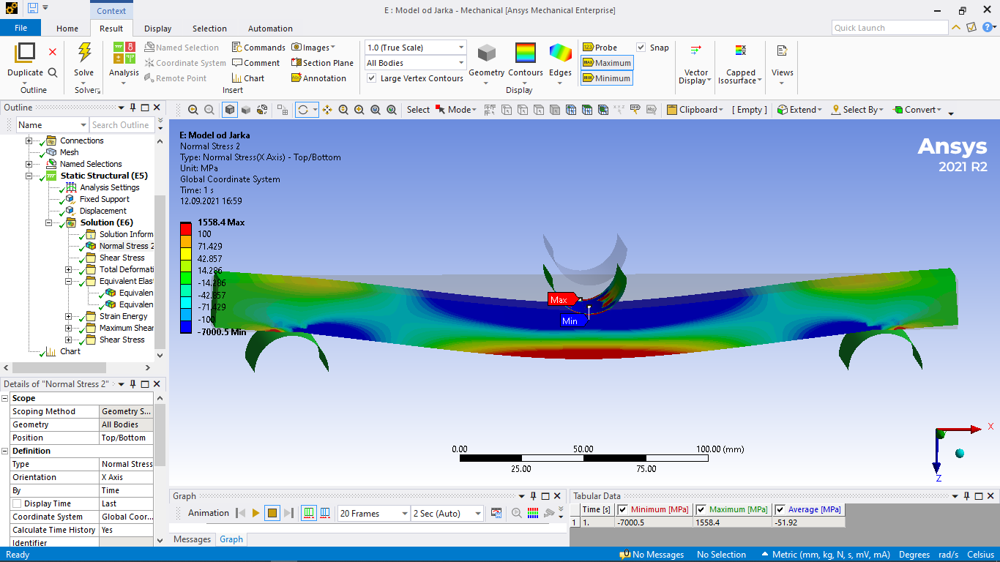
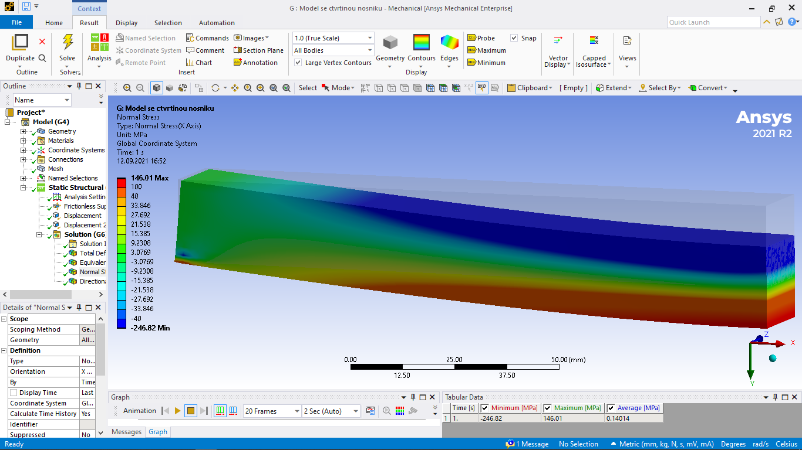
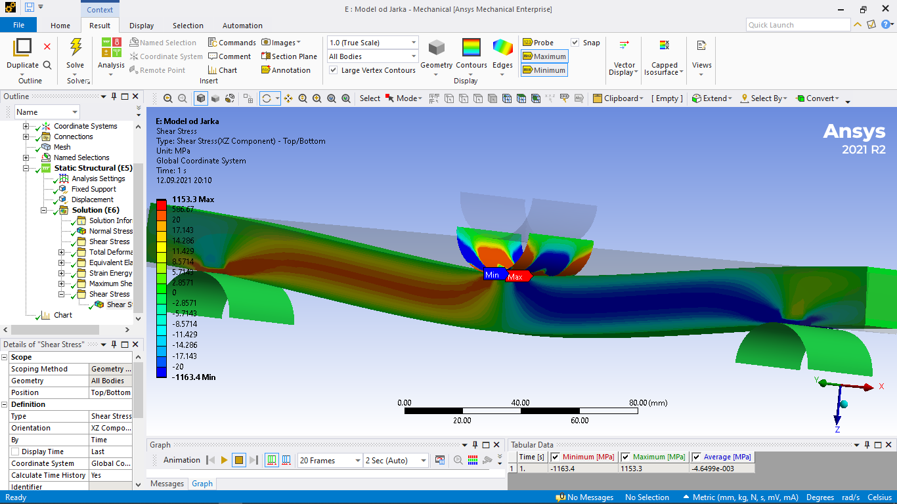

# Teorie elasticity ve 3D

## Tenzor napětí

* Napětí je podílem velikosti působící síly a velikosti plochy, na kterou tato síla působí. Pro sílu kolmou k ploše mluvíme o normálovém napětí, pro sílu ve směru plochy o smykovém napětí. 
* Znaménková konvence - viz obrázek. Napětí v obrázku jsou kladná, opačná napětí jsou záporná. Kladné normálové napětí tedy značí tah, záporné tlak. 
* V obrázku jsou napěí pouze na třech stěnách, na zbylých šesti jsou odpovídající napětí tak, aby element byl ve statické rovnováze, tj. aby výsledná síla a výsledný moment byly nulové.

$$
\sigma = \begin{pmatrix}
\sigma_x & \sigma_{xy} & \sigma_{xz}\cr
\sigma_{xy} & \sigma_y & \sigma_{yz}\cr
\sigma_{xz} & \sigma_{xy} & \sigma_{z}
\end{pmatrix}
$$

Tenzor napětí je bilineární forma, umožňuje výpočet síly na libovolně orientované ploše

### Praktická ukázka tenzoru napětí v tříbodovém ohybu

#### Tříbodový ohyb, tah v podélném směru

Tah na spodní straně, tlak na horní straně a před podpěrami. Zeleně neutrální oblast, kde je napětí nulové.

#### Tříbodový ohyb, tah v podélném směru pro čtvrtinu nosníku

Numerická simulace pro část nosníku šetří strojový čas a nároky na paměť. V tomto případě je možné použít symetrii a počítat pouze čtvrtinu nosníku.

#### Tříbodový ohyb, smykové napětí

Smykové napětí v levé a pravé polovině nosníku se liší znaménkem, je antisymetrické. 

## Linearizace vektoru posunutí, tenzor deformace

* linearizace, [nelineární transfromace a její linearizace](https://gist.github.com/robert-marik/dd01d023c30454183196d9c7b967aa00)
* separace rotační, posuvné a deformační složky 
* tenzor deformace $\varepsilon$

$$
\varepsilon = (\varepsilon_{ij}) = \left(\frac 12\left(\frac{\partial u_i}{\partial x_j} + \frac{\partial u_j}{\partial x_i} \right)\right)
$$

* Komponenty $\varepsilon_{ii}$ jsou normálové deformace, $\varepsilon_{ij}$ pro
  $i\neq j$ jsou smykové deformace.
* Normálová deformace udává, o kolik procent se materiál v daném směru prodlouží
  (kladná hodnota) nebo zkrátí (záporná hodnota). Smyková deformace udává, jak
  se změní pravé úhly (polovina změny velikosti úhlu v obloukové míře). 

## Hookův zákon pro izotropní, anizotropní a ortotropní materiál

Tenzory napětí a deformace upravíme na vektory. 

$$\varepsilon = \left(
    \begin{matrix}
    \varepsilon_x \\
    \varepsilon_y \\
    \varepsilon_z \\
    \varepsilon_{yz} \\
    \varepsilon_{xz} \\
    \varepsilon_{xy}
     \end{matrix} 
\right)
\quad \text{a} \quad
\sigma = \left(
     \begin{matrix}
    \sigma_x \\
    \sigma_y \\
    \sigma_z \\
    \sigma_{yz} \\
    \sigma_{xz} \\
    \sigma_{xy} 
     \end{matrix}
\right).
$$
Toto označení se nazývá Voigtova notace.

Matice poddajnosti je maticí, vyjadřující úměrnost mezi oběma tenzory. Slovně vyjádřeno, u každé komponenty deformace se sčítají příspěvky od všech komponent napětí, přičemž příspěvky od každého napětí jsou úměrné těmto napětím. To je přímá analogie jednorozměrného Hookova zákona $\varepsilon = \frac 1E \sigma$.

Obecný vztah mezi tenzorem napětí a tenzorem deformace pro lineární materiál je tedy dán vztahem

$$\left(
    \begin{matrix}
    \varepsilon_x \\
    \varepsilon_y \\
    \varepsilon_z \\
    \varepsilon_{yz} \\
    \varepsilon_{xz} \\
    \varepsilon_{xy}
     \end{matrix} 
\right)
=
\left(
    \begin{matrix}
    S_{11} & S_{12} & S_{13} & S_{14} & S_{15} & S_{16} \\
    S_{21} & S_{22} & S_{23} & S_{24} & S_{25} & S_{26} \\
    S_{31} & S_{32} & S_{33} & S_{34} & S_{35} & S_{36} \\
    S_{41} & S_{42} & S_{43} & S_{44} & S_{45} & S_{46} \\
    S_{51} & S_{52} & S_{53} & S_{54} & S_{55} & S_{56} \\
    S_{61} & S_{62} & S_{63} & S_{64} & S_{65} & S_{66} \\
     \end{matrix} 
\right)
\left(
     \begin{matrix}
    \sigma_x \\
    \sigma_y \\
    \sigma_z \\
    \sigma_{yz} \\
    \sigma_{xz} \\
    \sigma_{xy} 
     \end{matrix}
\right).
$$

Například $\varepsilon_x$ je dána vztahem
$$\varepsilon_x = S_{11}\sigma_x + S_{12}\sigma_y + S_{13}\sigma_z + S_{14}\sigma_{yz} + S_{15}\sigma_{xz} + S_{16}\sigma_{xy}.$$

Matice v této relaci se nazývá matice poddajnosti a je symetrická, tj. obsahuje pouze 21 nezávislých materiálových konstant.

$$\left(
    \begin{matrix}
    \varepsilon_x \\
    \varepsilon_y \\
    \varepsilon_z \\
    \varepsilon_{yz} \\
    \varepsilon_{xz} \\
    \varepsilon_{xy}
     \end{matrix} 
\right)
=
\left(
    \begin{matrix}
    S_{11} & S_{12} & S_{13} & \color{blue}S_{14} & \color{blue}S_{15} & \color{blue}S_{16} \\
     & S_{22} & S_{23} & \color{blue}S_{24} & \color{blue}S_{25} & \color{blue}S_{26} \\
     &  & S_{33} & \color{blue}S_{34} & \color{blue}S_{35} & \color{blue}S_{36} \\
     &  & & S_{44} & \color{red}S_{45} & \color{red}S_{46} \\
     \rlap{\text{symmetric}} & & &  & S_{55} & \color{red}S_{56} \\
     &  &  &  &  & S_{66} \\
     \end{matrix} 
\right)
\left(
     \begin{matrix}
    \sigma_x \\
    \sigma_y \\
    \sigma_z \\
    \sigma_{yz} \\
    \sigma_{xz} \\
    \sigma_{xy} 
     \end{matrix}
\right)
$$

Zpravidla se smykové namáhání projevuje jenom ve své vlastní rovině. Například smykové napětí $\sigma_{yz}$ vyvolává smykovou deformaci $\varepsilon_{yz}$, ale nevyvolává smykovou deformaci $\varepsilon_{xz}$ nebo $\varepsilon_{xy}$. Proto jsou červené vyznačené prvky dávající do relace smykové napětí v jedné rovině se smykovou deformací v jiné rovině nulové.

$$S_{45}=S_{46}=S_{56}=0$$

Tím je počet nezávislých materiálových konstant zredukován na 18.

### Ortotropní materiály

Ortotropní materiály jsou materiály, jejichž struktura se nemění při rotaci o $180^\circ$ okolo libovolné ze tří navzájem kolmých os. Typickým představitelem je dřevo. V tomto případě volíme často směry $x=L$, $y=R$, $z=T$. Platí $E_L>E_R>E_T$.

Modře vyznačené prvky v matici poddajnosti dávají do relace smykové namáhání a normálové napětí.
Při vhodné volbě souřadnic nevyvolávají normálová napětí smykovou deformaci a smyková napětí nevyvolávají normálovou deformaci.
 V pravém horním bloku matice jsou proto nuly. Matice poddajnosti se dále redukuje a počet materiálových konstant se snižuje na 9. 

$$\left(
    \begin{matrix}
    \varepsilon_x \\
    \varepsilon_y \\
    \varepsilon_z \\
    \varepsilon_{yz} \\
    \varepsilon_{xz} \\
    \varepsilon_{xy}
     \end{matrix} 
\right)
=
\left(
    \begin{matrix}
    S_{11} & S_{12} & S_{13} & 0 & 0 & 0 \\
     & S_{22} & S_{23} & 0 & 0  & 0 \\
     &  & S_{33} & 0 & 0 & 0 \\
     &  & & S_{44} & 0 & 0 \\
     \rlap{\text{symmetric}} & & &  & S_{55} & 0 \\
     &  &  &  &  & S_{66} \\
     \end{matrix} 
\right)
\left(
     \begin{matrix}
    \sigma_x \\
    \sigma_y \\
    \sigma_z \\
    \sigma_{yz} \\
    \sigma_{xz} \\
    \sigma_{xy} 
     \end{matrix}
\right)
$$

Materiálové vlastnosti určujeme pomocí devíti na sobě nezávislých materiálových konstant.

Konstanta úměrnosti mezi normálovým napětím $\sigma_i$ a normálovou deformací $\varepsilon_i$ se nazývá Youngův modul $E_i$. Platí $$
\varepsilon_i = \frac 1{E_i} \sigma_i\quad \text{ pro $i\in\{x,y,z\}$}.$$

Konstanta úměrnosti mezi smykovým napětím $\sigma_{ij}$ a smykovou deformací $\varepsilon_{ij}$ se nazývá smykový modul $G_{ij}$. Platí $$
\varepsilon_{ij} = \frac 1{G_{ij}} \sigma_{ij} \quad \text{ pro $i,j\in\{x,y,z\}$, $i\neq j$}.$$

Poměr mezi normálovou deformací v jednom směru a normálovou deformací v jiném směru se nazývá Poissonovo číslo $\nu_{ij}=-\frac{\varepsilon_j}{\varepsilon_i}$. Platí tedy $$\varepsilon_j = -\nu_{ij} \varepsilon_i
= - \frac{\nu_{ij}}{E_i} \sigma_i \quad\text{ pro $i,j\in\{x,y,z\}$, $i\neq j$}.$$

Pomocí Youngových modulů pro jednotlivé směry, pomocí Poissonova čísla a pomocí smykových modulů je možno formulovat Hookův zákon následovně.

$$\left(
    \begin{matrix}
    \varepsilon_x \\
    \varepsilon_y \\
    \varepsilon_z \\
    \varepsilon_{yz} \\
    \varepsilon_{xz} \\
    \varepsilon_{xy}
     \end{matrix} 
\right)
=
\left(
    \begin{matrix}
    \frac 1{E_x} & -\frac{\nu_{yx}}{E_y} & -\frac{\nu_{zx}}{E_z} & 0 & 0 & 0 \\
     & \frac 1{E_y} & -\frac{\nu_{zy}}{E_z} & 0 & 0  & 0 \\
     &  & \frac 1{E_z} & 0 & 0 & 0 \\
     &  & & \frac 1{G_{yz}} & 0 & 0 \\
     \rlap{\text{symmetric}} & & &  & \frac 1{G_{xz}} & 0 \\
     &  &  &  &  & \frac 1{G_{xy}} \\
     \end{matrix} 
\right)
\left(
     \begin{matrix}
    \sigma_x \\
    \sigma_y \\
    \sigma_z \\
    \sigma_{yz} \\
    \sigma_{xz} \\
    \sigma_{xy} 
     \end{matrix}
\right)
$$

### Materiály izotropní v jedné rovině

Materiály izotropní v jedné rovině (též uniaxiální, transerzálně symetrické, ...) jsou materiály podobné ortotropním, ale ve dvou ze tří směrů mají stejné materiálové vlastnosti a díky tomu mají stejné vlastnosti ve všech směrech této roviny. Typickým představitelem jsou sendvičové materiály, například geologické vrstvy. 

Konstanty související s izotropií jsou stejné. Například pro materiál izotropní v rovině $xy$ vypadá materiálový vztah následovně. 

$$\left(
    \begin{matrix}
    \varepsilon_x \\
    \varepsilon_y \\
    \varepsilon_z \\
    \varepsilon_{yz} \\
    \varepsilon_{xz} \\
    \varepsilon_{xy}
     \end{matrix} 
\right)
=
\left(
    \begin{matrix}
    S_{11} & S_{12} & S_{13} & 0 & 0 & 0 \\
     & S_{11} & S_{13} & 0 & 0  & 0 \\
     &  & S_{33} & 0 & 0 & 0 \\
     &  & & S_{44} & 0 & 0 \\
     \rlap{\text{symmetric}} & & &  & S_{44} & 0 \\
     &  &  &  &  & S_{66} \\
     \end{matrix} 
\right)
\left(
     \begin{matrix}
    \sigma_x \\
    \sigma_y \\
    \sigma_z \\
    \sigma_{yz} \\
    \sigma_{xz} \\
    \sigma_{xy} 
     \end{matrix}
\right)
$$

Tyto materiály popisujeme pomocí pěti nezávislých materiálových konstant. Šestá konstanta je dána vztahem
$$S_{66} = 2(S_{11}-S_{22}).$$

### Izotropní materiály

Izotropní materiály mají ve všech směrech stejné vlastnosi. 

$$S_{11}=S_{22}=S_{33}=\frac 1E, \quad S_{ij}=-\frac{\nu}{E} \text {pro $i\neq j$, $i,j\in\{1,2,3\}$}$$

$$S_{44}=S_{55}=S_{66}=\frac 1G$$

$$\left(
    \begin{matrix}
    \varepsilon_x \\
    \varepsilon_y \\
    \varepsilon_z \\
    \varepsilon_{yz} \\
    \varepsilon_{xz} \\
    \varepsilon_{xy}
     \end{matrix} 
\right)
=
\left(
    \begin{matrix}
    S_{11} & S_{12} & S_{12} & 0 & 0 & 0 \\
     & S_{11} & S_{12} & 0 & 0  & 0 \\
     &  & S_{11} & 0 & 0 & 0 \\
     &  & & S_{44} & 0 & 0 \\
     \rlap{\text{symmetric}} & & &  & S_{44} & 0 \\
     &  &  &  &  & S_{44} \\
     \end{matrix} 
\right)
\left(
     \begin{matrix}
    \sigma_x \\
    \sigma_y \\
    \sigma_z \\
    \sigma_{yz} \\
    \sigma_{xz} \\
    \sigma_{xy} 
     \end{matrix}
\right)
$$

Pomocí Youngova modulu, smykového modulu a Poissonova čísla dostáváme následující vztah. 

$$\left(
    \begin{matrix}
    \varepsilon_x \\
    \varepsilon_y \\
    \varepsilon_z \\
    \varepsilon_{yz} \\
    \varepsilon_{xz} \\
    \varepsilon_{xy}
     \end{matrix} 
\right)
=
\left(
    \begin{matrix}
    \frac 1E & -\frac{\nu}{E} & -\frac{\nu}{E} & 0 & 0 & 0 \\
     & \frac 1E & -\frac{\nu}{E} & 0 & 0  & 0 \\
     &  & \frac 1E & 0 & 0 & 0 \\
     &  & & \frac 1G & 0 & 0 \\
     \rlap{\text{symmetric}} & & &  & \frac 1G & 0 \\
     &  &  &  &  & \frac 1G \\
     \end{matrix} 
\right)
\left(
     \begin{matrix}
    \sigma_x \\
    \sigma_y \\
    \sigma_z \\
    \sigma_{yz} \\
    \sigma_{xz} \\
    \sigma_{xy} 
     \end{matrix}
\right)
$$

Izotropní materiály charakterizujeme pomocí tří materiálových konstant. Mezi těmito konstantami je vztah 
$$G = \frac{E}{2(1+\nu)}.$$
Hodnota $\nu$ pro izotropní materiály je zpravidla blízká číslu $0.33$.

Malá hodnota $\nu$ znamená, že materiál se při zatížení v jednom směru deformuje jenom málo v kolmých směrech. Taková vlastnost je vhodná například pro zátky lahví. Korek má velmi malou hodnotu $\nu$, jinak by bylo komplikované láhev otevřít nebo uzavřít. 

Velká hodnota $\nu$ znamená, že materiál se při zatížení v jednom směru deformuje výrazně i v kolmých směrech. Takové materiály jsou špatně objemově stlačitelné. Příkladem je guma a další tlumící materiály.

## Přímé nosníky

* Posouvající síla a ohybový moment u nosníků.
* Diferenciální rovnice ohybové čáry nosníku
