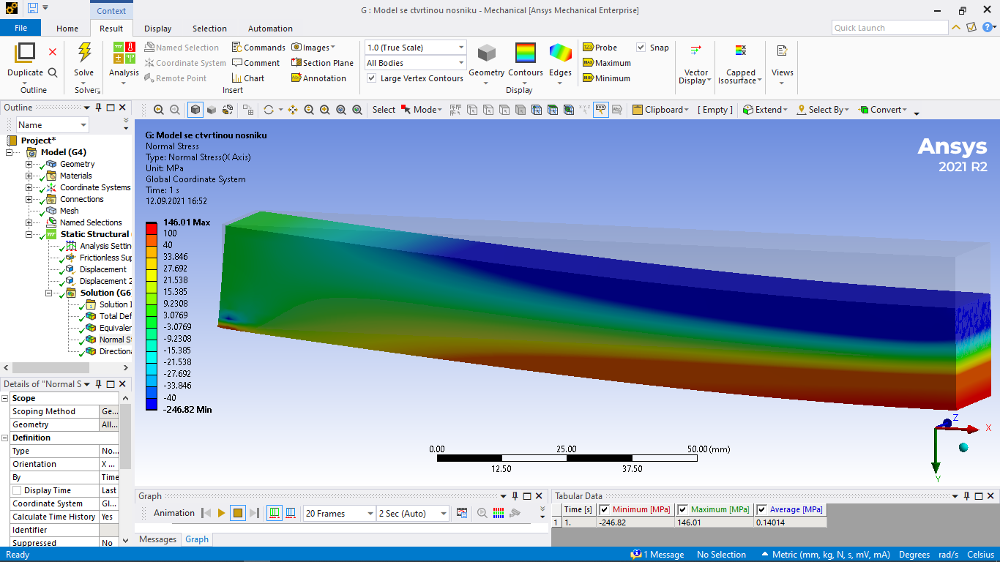

# Základy teorie elasticity

## První a druhá impulsová věta.

### Popis posuvného a rotačního pohybu tělesa

Fyzikální parametry pro popis posuvného pohybu tělesa:
  * hmotnost tělesa $m$
  * rychlost tělesa $\vec v$
  * hybnost tělesa $\vec p = m \vec v$

Fyzikální parametry pro popis rotačního pohybu tělesa:
  * moment setrvačnosti tělesa $J$
  * úhlová rychlost tělesa $\vec \omega$
  * moment hybnosti tělesa $\vec L = J \vec \omega$

### Impulsové věty

```{prf:theorem} První impulsová věta
:nonumber:

Časová změna celkové hybnosti tělesa (soustavy) je rovna součtu vnějších sil působících na těleso (soustavu).

$$ \frac{d\vec p}{dt} = \sum \vec F $$
```

```{prf:theorem} Druhá impulsová věta
:nonumber:

Časová změna celkového momentu hybnosti tělesa (soustavy) je rovna celkovému momentu vnějších sil působících na těleso.

$$ \frac{d\vec L}{dt} = \sum \vec M $$
```

### Podmínky rovnováhy

```{prf:theorem} Podmínka statické rovnováhy
:nonumber:

$$\sum \vec F = \sum \vec M = 0$$
```


## Teorie elasticity

* Deformace, namáhání a Hookův zákon v 1D
* Deformace, namáhání a Hookův zákon ve 2D
  * [obecná deformace a její linearizace](https://gist.github.com/robert-marik/dd01d023c30454183196d9c7b967aa00)
  * <a href="../notebooks/matice_symetrizace.html">symetrizace</a>

## Numerické simulace



  
