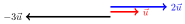
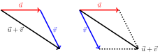

# Vektory

Lineární algebra se zabývá vícerozměrnými veličinami (vektory) a vztahy mezi
nimi. 

V části věnované lineární algebře se naučíte:

* Ukážeme si, že fyzikální veličiny mohou být vícerozměrné nebo mnohorozměrné. Poté jsou reprezentovány vektory. 
* Ukážeme si, že vztahy mezi vektory je možné formulovat pomocí matic. Získáváme tak aparát, který je možno použít k popisu geometrických transformací (využití je při zobrazování), k popisu materiálové odezvy na gradient teploty či gradient koncentrace (Fourierův a Fickův zákon).

## Motivace

Jednou ze základních úloh v praxi je posoudit reakci objektu na působení vnějších sil. Například změna tvaru při namáhání. Pro popis úloh tohoto typu zpravidla dělíme těleso na malé elementy a popisujeme, co se s těmito elementy děje: o kolik se posunou, jestli a jak změní svůj tvar nebo objem a podobně. 

  

Pro modelování deformace potřebujeme mít možnost jednoznačně identifikovat dílčí elementy a být schopni popsat změnu jejich tvaru a polohy při deformaci. K tomu je možno použít souřadnice. V prostoru jsou souřadnice tvořeny trojicemi, v rovině dvojicemi čísel. Takové objekty patří v matematice mezi vektory.

## Příklady vektorů

Základním objektem v lineární algebře je vektor. Nejčastěji vyjadřujeme vektory jako uspořádané $n$-tice nebo orientované úsečky. 

Formální definici vektorů neuvádíme. Zjednodušeně řečeno, je to algebraická struktura s jistými pravidly, které nás opravňují s vektory pracovat tak, jak to v běžných případech potřebujeme. Tedy sčítat vektory, násobit vektory číslem anebo měřit úhel mezi dvěma vektory.

* Dvourozměrné a trojrozměrné vektory se používají k práci s fyzikálními
  veličinami, u kterých si všímáme směru. 
  Příklady zahrnují následující.
  * Rychlost pohybu. 
      * Orientovaná úsečka, jejíž orientace udává směr pohybu a délka udává okamžitou rychlost.
      * Uspořádaná dvojice nebo trojice, kde jednotlivé komponenty udávají rychlost ve směru příslušných os.
  * Polohový vektor bodu v prostoru spojuje počátek s uvažovaným bodem. Opět můžeme modelovat jako orientovanou úsečku z počátku do příslušného bodu, nebo dvojici či trojici hodnot udávající souřadnice bodu. Pro pohybující se bod je tento vektor funkcí času.
  * Posunutí, tj. změna polohy v prostoru. Tento vektor spojuje počáteční a koncovou pozici
    posunutého bodu.
  * Síla a moment síly.
  * Spád skalární veličiny. Tento vektor dává do pohybu transportní děje, jako transport tepla, transport vody materiálem, transport iontů nebo molekul při impregnaci apod. Směr ukazuje, kterým směrem klesá veličina nejrychleji a velikost udává, jaká tato rychlost je. 
* Vícerozměrné vektory se používají u jakékoliv sady dat, kterou uspořádáme do
  sloupce nebo řádku. Poté má smysl pracovat s vektory libovolné dimenze.
  Příklady zahrnují následující.
  * Na konstrukci je zvoleno $N$ bodů. Sledujeme změnu polohy těchto
    bodů. Pokud se body mohou pohybovat s jedním stupněm volnosti,
    dostáváme $N$-rozměrný vektor. Obecněji, pokud není pohyb omezen,
    musíme sledovat polohu ve všech třech nezávislých směrech a
    pracujeme s vektorem dimenze $3N$.
  * Podobně jako předchozí příklad, ale můžeme pracovat s bodovými silami
    působícími na konstrukci.
  * Na objektu je zvoleno $N$ bodů a sledujeme teplotu v těchto bodech.   

## Operace s vektory

**Násobení vektoru s číslem** je definováno jako součin daného čísla a jednotlivých komponent  vektoru, resp. jako vektor mířící *stejným směrem* jehož délka je odpovídajícím násobkem délky původního vektoru. (V případě záporného čísla násobíme absolutní hodnotou a otáčíme směr).

* Pro $\vec u = \begin{pmatrix} 3\cr 1\end{pmatrix}$ platí $3\vec u = \begin{pmatrix} 9\cr 3\end{pmatrix}$.
* Grafické násobení: 

**Sčítání vektorů** je definováno po složkách pro uspořádané $n$-tice a jako celkové posunutí složené ze dvou dílčích posunutí pro orientované vektory. Variantou grafického sčítání vektorů je doplnění na rovnoběžník, viz obrázky.

1. **Algebraický součet.** Pro $\vec u = \begin{pmatrix} 3\cr 1\end{pmatrix}$ a $\vec v = \begin{pmatrix} 2\cr 5\end{pmatrix}$ platí $\vec u +\vec v = \begin{pmatrix} 5\cr 6\end{pmatrix}$.
1. **Grafický součet.** Buď umístíme jeden vektor do koncového bodu druhého vektoru, nebo doplníme na rovnoběžník. 
 

